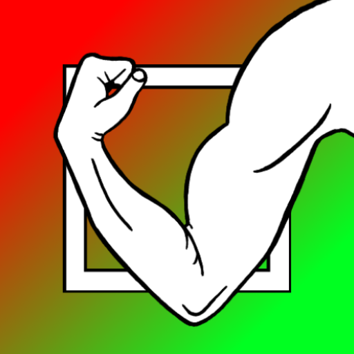

# Task Master

Task Master is an Android application that functions as a to-do list.  Unlike regular to-do lists, this application incorporates user-defined importance and urgency levels to create a colored visualization.  More important tasks rise to the top, and more urgent tasks go to the left.  The upper-left corner is red (high importance and urgency) and the lower-right corner is green (low importance and urgency).  This setup was inspired by the book *Seven Habits of Highly Effective People* by Stephen Covey.

This app is to make a task list appear more manageable by having all tasks displayed on a single screen without  scrolling or multiple pages.  The only exception is when a popup is provided for a group of tasks in a cluster.  It is also intended to allow the user to more effectively prioritize their tasks once seen on the importance/urgency spectrum.

## Getting Started

To work on this project, simply [clone it](https://github.com/robbie9485/Task-Master.git) onto your hard drive.  The bulk of the code is in the directory [`app/src/main`](https://github.com/robbie9485/Task-Master/tree/master/app/src/main).  Note that the [java files](https://github.com/robbie9485/Task-Master/tree/master/app/src/main/java/com/rsquared/taskmaster) were all written for this project, but not all of the [XML files](https://github.com/robbie9485/Task-Master/tree/master/app/src/main/res) were, so use care when navigating this folder.  The following folders contain custom XML files:

* [`drawable`](https://github.com/robbie9485/Task-Master/tree/master/app/src/main/res/drawable)
* [`layout`](https://github.com/robbie9485/Task-Master/tree/master/app/src/main/res/layout)
* [`values`](https://github.com/robbie9485/Task-Master/tree/master/app/src/main/res/values)

### Prerequisites

[Android Studio](https://developer.android.com/studio)

### Installing

Assuming you have Android Studio up and running, you can do the following to get a working environment up and running:

1. Open Android Studio
2. Go to `File` menu and then click `Close` if you have another project showing
3. Click `Get from Version Control`
4. Enter `https://github.com/robbie9485/Task-Master.git` into the `URL` field
5. Select a location on your hard drive to house the project under `Directory`
6. Click `Clone`

## High Level Overview

The basic components are divided into classes and fragments:

### `MainActivity.java`

Initial opening of app is managed in this class.  It simply coordinates fragment creation, destruction, and general navigation.

### `FragmentTaskDraw.java`

This fragment controls the custom `TaskDraw` view and it's child view, the `GroupPopup` class.  The color graphic at the top of the screenshot provided early shows the `FragmentTaskDraw` in action.  It negotiates all finger taps with their associated action, usually by implementing a function in `TaskDraw` or `GroupPopup`.

### `FragmentInstructions.java`

This class simply shows some plain text instructions for the app

### `FragmentAddButton.java`

This class simply supplies the `Add Task` button to the main screen.

### `FragmentAddOrModifyTask.java`

This class supplies forms for adding or editing tasks (name, urgency, and importance).  Upon submission, the `TaskViewModel` object is called up to update the information.  Submission also brings the user to the home screen.

### `Task.java`

`Task` object class.  This class holds the information for a task (label, urgency, and importance), along with methods for adding or changing information for a task.

### `TaskGroup.java`

`Task` group object class.  Holds basically the same information as the `Task` object, except it also holds a cluster of tasks that would otherwise be on top of each other.  The extended features include adding tasks, removing tasks, combining with other groups, etc.

### `TaskGraphic.java`

Holds all graphic information for a task group or task (position, text dimensions, etc).  Was formerly a sub class of the `Task` object, but it was broken out for clarity.  Note that a `TaskGroup` object must also use `TaskGraphic` to be seen on the screen.

### `TaskDatabaseContract.java`

Holds all the information for the SQLite database: table names, field names, queries for updating, adding, etc.

### `TaskDatabaseHelper.java`

Provides mathods for interacting with the database using information from `TaskDatabaseContract` and data from `TaskViewModel`

### `TaskViewModel.java`

This is a `ViewModel` that can be accessed anywhere and survives the lifecycle of the fragments.  It holds all the tasks and groups in memory and calls on the `TaskDatabaseHelper` object to store and retrieve information.

### `TaskDraw.java`

This large class is the heart of the program and contains all the methods and informatino necessary for constructing a Java AWT canvas and displaying the current `Task` and `TaskGroup` information.  It basically draws everything necessary for the display.

### `GroupPopup.java`

In case the the canvas in `TaskDraw` becomes too crowded in any given area, tha `Task` objects are combined into a `TaskGroup`, which, when tappped, shows the popup object provided by this class to display the individual tasks in the group.  For example:

## Running tests

If you wish to perform some tests on the system, there is a function in `MainActivity.java` called `resetDatabase()`.  Calling this function if you wish to start from scratch with some custom values for testing.

***Warning! Using this function will completely erase any tasks you've created!  Use with caution!***

### Example tests

Here are some examples of tests that were performed on this app prior to commiting it:

* Creating a new task using the `Add Task` button
* Marking a task as complete by tapping it, then closing the app and reopening it to make sure it's dissapeared
* Modifying a task by double tapping or tapping and holding it
* Create tasks close to boundaries (0% or 100% importance and urgency)
* Creating many tasks in the same vicinity and making sure the app replaces it with `+(# of tasks) Tasks`, a group of tasks graphic
* Make sure the background color of a popup for a group of tasks is appropriate for it's location (i.e.: background at that location is red, so the background color of the popup for a group of tasks has the same color, or close to it)
* Given a group of tasks, try adding a task to the group, moving a task out of the group, and marking a task within a group popup as completed and then restarting to see if it dissapeared as expected
* Rotate the view while the app is running
* Turn off screen while the app is running and turn it on again

## Deployment

This app is avaialable for download on [Google Play](https://play.google.com/store/apps/details?id=com.rsquared.taskmaster)

## Built With

[Android Studio](https://developer.android.com/studio)

## Contributing

Please contact me (robbie9485) on GitHub in order to inquire more about the project.

## Versioning

`Git` functions in Android Studio were used to version the software on *GitHub*

## Authors

Robert Rutherford

## License

This project is licensed under the MIT License - see the [LICENSE.txt](LICENSE.txt) file for details

## Acknowledgments

* Thanks to Stephen Covey, author of *7 Habits Of Highly Effective People*, for providing the inspiration and knowledge to spark the idea for this app
* My family for supporting my continued efforts at software developement
* My friend Victor for patiently talking me through a lot of my blunders with Android Studio and coding in general
