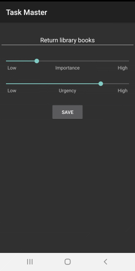
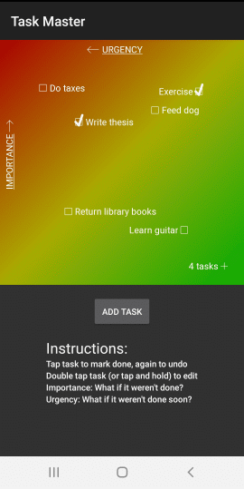
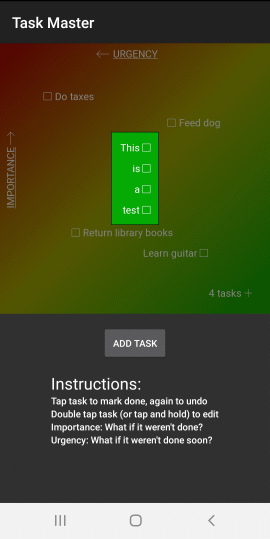

# Task Master

Task Master is an Android application ([available for download on Google Play](https://play.google.com/store/apps/details?id=com.rsquared.taskmaster&hl=en&gl=US)) that functions as a to-do list.  Unlike regular to-do lists, this application incorporates user-defined importance and urgency levels to create a colored visualization.  More important tasks rise to the top, and more urgent tasks go to the left.  The upper-left corner is red (high importance and urgency) and the lower-right corner is green (low importance and urgency).  

This app is to make a task list appear more manageable by having all tasks displayed on a single screen without  scrolling or multiple pages.  The only exception is when a popup is provided for a group of tasks in a cluster.  It is also intended to allow the user to more effectively prioritize their tasks once seen on the importance/urgency spectrum.

## Table of Contents

- [Background](#background)
- [Install](#install)
- [Usage](#usage)
- [Contributing](#contributing)
- [License](#license)
- [Acknowledgements](#acknowledgments)

## Background

This setup was inspired by the book [*Seven Habits of Highly Effective People*](https://www.franklincovey.com/the-7-habits/) by Stephen Covey.  He emphasized categorizing tasks by importance and urgency and then tackling them accordingly, so this app is an effort to do just that.

## Install

To work on this project, simply [clone it](https://github.com/rbrutherford3/Task-Master-Android.git) onto your hard drive.  The bulk of the code is in the directory [`app/src/main`](https://github.com/rbrutherford3/Task-Master-Android/tree/master/app/src/main).  Note that the [java files](https://github.com/rbrutherford3/Task-Master-Android/tree/master/app/src/main/java/com/rsquared/taskmaster) were all written for this project, but not all of the [XML files](https://github.com/rbrutherford3/Task-Master-Android/tree/master/app/src/main/res) were, so use care when navigating this folder.  The following folders contain custom XML files:

* [`drawable`](https://github.com/rbrutherford3/Task-Master-Android/tree/master/app/src/main/res/drawable)
* [`layout`](https://github.com/rbrutherford3/Task-Master-Android/tree/master/app/src/main/res/layout)
* [`values`](https://github.com/rbrutherford3/Task-Master-Android/tree/master/app/src/main/res/values)

Assuming you have Android Studio up and running, you can do the following to get a working environment up and running:

1. Open Android Studio
2. Go to `File` menu and then click `Close` if you have another project showing
3. Click `Get from Version Control`
4. Enter `https://github.com/rbrutherford3/Task-Master.git` into the `URL` field
5. Select a location on your hard drive to house the project under `Directory`
6. Click `Clone`

## Usage

To begin, open the app on your phone.

To add a task, tap **ADD TASK** and tap the sliders to vary the urgency and importance of the task.  Tap **SAVE** to finish.

Tap the checkbox next to an app to check it off.  It will clear when you close the app.

Note that when apps cluster together they appear with a number and a plus sign to save space.  Tap it to see all the tasks in that area.

You can also edit a tak by double tapping it or tapping and holding.  It will move based on your changes.

## Contributing

Contributions are welcome.  Please contact rbrutherford3 on GitHub in order to inquire more about the project.

## License

[MIT © Robert Rutherford](../LICENSE)

## Acknowledgments

* Thanks to Stephen Covey, author of *7 Habits Of Highly Effective People*, for providing the inspiration and knowledge to spark the idea for this app
* My family for supporting my continued efforts at software development
* My friend Victor for patiently talking me through a lot of my blunders with Android Studio and coding in general
